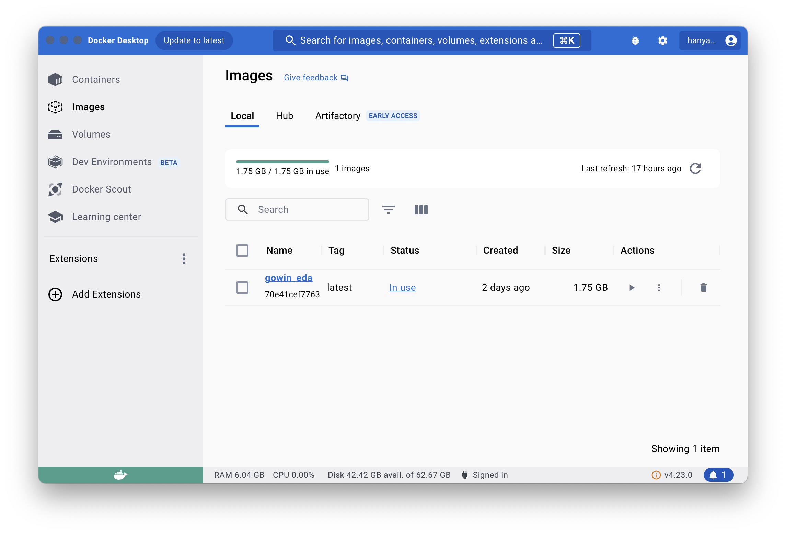
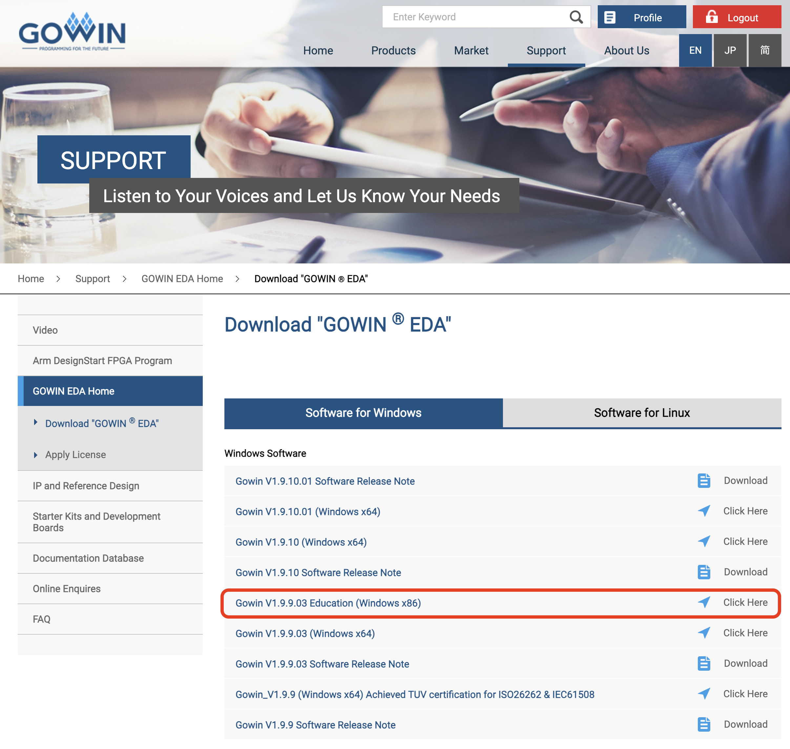

# MyGowinFPGAScratchPad

Intel macのdockerコンテナでLinux版のGowin EDAを動かして、
GUIなしコマンドラインのみでTangNanoをプログラムします。

## 準備

  * openFPGALoaderをインストールします  
    https://github.com/trabucayre/openFPGALoader
  * Docker Desktopをインストールします  
    
  * このプロジェクトをダウンロードします  
  ```bash
git clone https://github.com/hanyazou/MyGowinFPGAScratchPad.git
git submodule init
git submodule update
  ```
  * GOWINのサイトからGown V1.9.9.03 Education (Windows ×86)をダウンロードします  
    https://www.gowinsemi.com/en/support/download_eda
    
  ```bash
% cd MyGowinFPGAScratchPad
% ls -l
-rw-r--r--  1 hanyazou  staff        943 Aug 14 08:34 Dockerfile
-rw-r--r--@ 1 hanyazou  staff  448665778 Aug 11 17:50 Gowin_V1.9.9.03_Education_linux.tar.gz
-rw-r--r--  1 hanyazou  staff        612 Aug 14 09:05 README.md
drwxr-xr-x  3 hanyazou  staff         96 Aug 14 08:37 examples
drwxr-xr-x  3 hanyazou  staff         96 Aug 14 08:43 images
-rwxr-xr-x  1 hanyazou  staff       4179 Aug 14 08:37 macgowin
  ```

## 使い方

### ビルド

macgowinのスクリプトでbuildを実行すると、dockerコンテナが作成されて、GOWIN EDAを展開、
指定されたフォルダにあるVerilogのソースコードを合成して
ビットストリーム（.fsファイル）を作成します。
結果は全てカレントディレクトリのimpl/に出力されます。

以下の例では、examples/blinkをビルドします。

```bash
% ./macgowin build examples/blink
add_file /home/user/MyGowinFPGAScratchPad/examples/blink/./led.v
add_file /home/user/MyGowinFPGAScratchPad/examples/blink/./tangnano20k.cst
set_device "GW2AR-LV18QN88C8/I7"
set_option -top_module led
set_option -verilog_std v2001
set_option -cst_warn_to_error 1
run all
*** GOWIN Tcl Command Line Console  *** 
add new file: "/home/user/MyGowinFPGAScratchPad/examples/blink/./led.v"
add new file: "/home/user/MyGowinFPGAScratchPad/examples/blink/./tangnano20k.cst"
current device: GW2AR-18C  GW2AR-LV18QN88C8/I7
GowinSynthesis start
Running parser ...
NOTE  (EX0101) : Current top module is "led"
[5%] Running netlist conversion ...
Running device independent optimization ...
Running inference ...
Running technical mapping ...
[95%] Generate netlist file "/home/user/MyGowinFPGAScratchPad/examples/blink/impl/gwsynthesis/project.vg" completed
GowinSynthesis finish
Reading netlist file: "/home/user/MyGowinFPGAScratchPad/examples/blink/impl/gwsynthesis/project.vg"
Parsing netlist file "/home/user/MyGowinFPGAScratchPad/examples/blink/impl/gwsynthesis/project.vg" completed
Processing netlist completed
Reading constraint file: "/home/user/MyGowinFPGAScratchPad/examples/blink/tangnano20k.cst"
Physical Constraint parsed completed
Running placement......
Running routing......
Running timing analysis......
Placement and routing completed
Bitstream generation in progress......
Bitstream generation completed
Running power analysis......
Tue Aug 13 22:35:05 2024
```
（上記出力は一部省略されています）

### 実行

macgowinのスクリプトでrunを実行すると、openFPGALoaderでimpl/pnr/project.fsが

```bash
% ./macgowin run
Jtag frequency : requested 6.00MHz   -> real 6.00MHz
Parse file Parse ./impl/pnr/project.fs: 
Done
DONE
Jtag frequency : requested 2.50MHz   -> real 2.00MHz
erase SRAM Done
Flash SRAM: [==================================================] 100.00%
Done
```

SRAMに転送して実行するだけでなく、TangNano 20Kの不揮発メモリに書き込む場合には、runのかわりに
flashを指定します。

```bash
% ./macgowin flash
write to flash
Jtag frequency : requested 6.00MHz   -> real 6.00MHz
Parse file Parse ./impl/pnr/project.fs: 
Done
DONE
Jtag frequency : requested 2.50MHz   -> real 2.00MHz
Jtag frequency : requested 10.00MHz  -> real 6.00MHz
erase SRAM Done
Detected: Winbond W25Q64 128 sectors size: 64Mb
Detected: Winbond W25Q64 128 sectors size: 64Mb
RDSR : 00
WIP  : 0
WEL  : 0
BP   : 0
TB   : 0
SRWD : 0
00000000 00000000 00000000 00
Erasing: [==================================================] 100.00%
Done
Writing: [==================================================] 100.00%
Done
```

### プロジェクトの作成

新規プロジェクトを作成するには、適当なフォルダを作成し、必要なファイルを配置します。
ビルド可能な最小限のプロジェクトには、最低以下の3つのファイルが必要です。

  * Verilogのソースコード（*.v）
  * 制約条件（*.cst）
  * ビルドスクリプト（gw_sh.script）  
    このファイルは、macgowinで\${BOARD}, \${DEVICE}などを置換されGOWIN EDAのコマンドラインツール
    gw\_shで実行されます。  

```bash
% ls -l examples/myproj
-rw-r--r--  1 hanyazou  staff   177 Aug 14 09:28 gw_sh.script
-rw-r--r--  1 hanyazou  staff  1375 Aug 14 08:37 myproj.v
-rw-r--r--  1 hanyazou  staff   165 Aug 14 08:37 tangnano20k.cst
```

## 参照

### TangNano 20K LED Blink サンプル

TangNano 20KとGOWIN EDAでLチカします。
examples/Blinkは、このページの内容を元にしています。  
https://github.com/sipeed/sipeed_wiki/blob/main/docs/hardware/en/tang/tang-nano-20k/example/led.md

### Gowin Software User Guide

gw_shで使用できるコマンドについて説明があります。  
https://cdn.gowinsemi.com.cn/SUG100E.pdf

### Verilog-HDL入門

回路設計未経験者向けに必要最低限のVerilog-HDL文法を解説した入門書です。  
https://openit.kek.jp/training/2019/fpga/introduction-to-veriloghdl.pdf

### SystemVerilog による論理回路設計(授業用)

Verilogで作成する論理回路、順序回路、ステートマシンなどをわかりやすく説明しています。  
CPU設計実習(授業用) というのもあるようです。  
https://qiita.com/rikitoro@github

### Gowin EDAをM2 Macで動かす

Intel Macでなくても、頑張れば動くらしいです...  
https://note.com/kohshi54/n/n9b3c98ed098f
